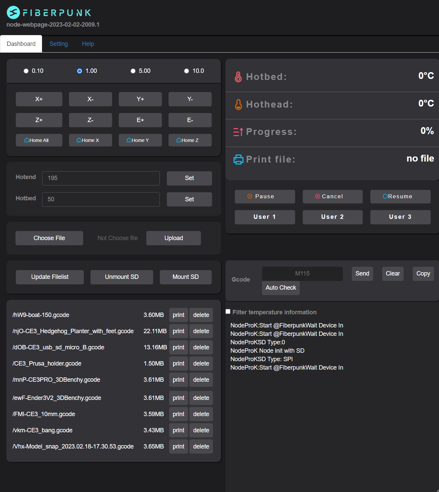

# NodeWebpage
Node's webpage

This web page runs inside Node. It is a lightweight web application that can display the information returned by the serial port of the printer in real time, upload and manage files, and perform the most basic control of the printer.

Since the web page storage space of ESP32 is very limited, there are very few js libraries that Node web pages can use.

# Development Resources

For the webapi description document implemented by the web page, please refer to this [document](./NodeWebAPI.md).

Refer to this [document](https://docs.google.com/presentation/d/1EhdrxVowPHj--iUrkvdkC4d59uzsc6_Up4gLxd3CpAw/edit?usp=sharing) to update the webpage individually. You can just update the webpage without updating the firmware.

